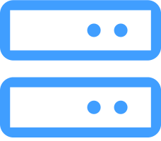

<!--
**BertramYe/BertramYe** is a ✨ _special_ ✨ repository because its `README.md` (this file) appears on your GitHub profile.

Here are some ideas to get you started:

- 🔭 I’m currently working on ...
- 🌱 I’m currently learning ...
- 👯 I’m looking to collaborate on ...
- 🤔 I’m looking for help with ...
- 💬 Ask me about ...
- 📫 How to reach me: ...
- 😄 Pronouns: ...
- ⚡ Fun fact: ...
-->

<h1 align="center">👋 Hello! 
I'm  <a  href="https://github.com/BertramYe"> Bertram </a>
</h1>

I'm a fullstack developer and designer building digital products using Lean Design principles. 

<image src='assets/Developer.gif'>

 
When I'm not coding find me leaning all kinds of the new technology and try it with my private projects.

 

<h2  align="left"> 
⚡ Techs I work on 
</h2>

<h3 align="left"> Frontend </h3>

<h3 align="left">   Backend </h3>

<h3 align="left">   DataBase </h3>

<h3 align="left">  Deployment </h3>

<h3 align="left">  Cloud </h3>

 

<h2  align="left"> 
📫 How to reach me
</h2>

 
<a href="https://www.bertram-world.com/" >

Bertram's Blog
</a>

 
<a href="https://github.com/BertramYe" >

Bertram's GitHub
</a>

 

 

<h2  align="left"> 
  Vistitors
</h2>

